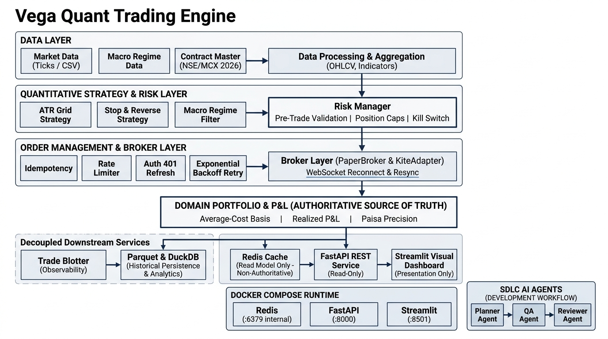

# Vega Quant Trading Engine

A deterministic Python trading-engine prototype designed to demonstrate quantitative strategy execution, centralized risk management, broker reliability, backtesting, Indian-market compliance, and production-oriented software engineering practices. Built around Indian equity and derivative markets (NSE/MCX).

---

## Verification & Status

```
Regression Suite:    401 passed (pytest -q, ~4.8s)
Docker Compose:      Redis (healthy) → API (healthy) → Dashboard (healthy)
Container Status:    3/3 services healthy on private bridge network
Failover Verified:   Truthful offline diagnostic on API interruption; zero synthetic data
```

- **API Failure Detection**: Streamlit UI immediately transitions to `🔴 API OFFLINE` when the backend is halted; no stale or manufactured data is displayed.
- **Automatic Recovery**: Reconnecting the API container restores live telemetry with complete provenance transparency (`source: domain` or `source: cache`).
- **Redis Cache Isolation**: Redis serves strictly as a fast read cache; if Redis fails or restarts, the API seamlessly falls back to authoritative in-memory domain state.
- **WebSocket Reliability**: Tested for disconnect detection, exponential backoff, sequence gap detection, and state resynchronization.
- **Risk Invariants**: Pre-trade order validation, position caps, and emergency kill switches remain centralized and immutable across backtest and live execution paths.

---

## Table of Contents

1. [Overview](#1-overview)
2. [Key Features](#2-key-features)
3. [System Architecture](#3-system-architecture)
4. [Project Structure](#4-project-structure)
5. [Trading Strategies](#5-trading-strategies)
6. [Technical Indicators](#6-technical-indicators)
7. [Macro Regime Engine](#7-macro-regime-engine)
8. [Risk Management](#8-risk-management)
9. [Order Management & Broker Reliability](#9-order-management--broker-reliability)
10. [Backtesting Engine](#10-backtesting-engine)
11. [Walk-Forward Evaluation](#11-walk-forward-evaluation)
12. [Real-Time Tick Pipeline](#12-real-time-tick-pipeline)
13. [Indian Market Plumbing](#13-indian-market-plumbing)
14. [Data & Storage](#14-data--storage)
15. [Observability & Auditability](#15-observability--auditability)
16. [REST API Layer](#16-rest-api-layer)
17. [Streamlit Dashboard](#17-streamlit-dashboard)
18. [Docker & Reproducible Runtime](#18-docker--reproducible-runtime)
19. [SDLC AI-Agent Framework](#19-sdlc-ai-agent-framework)
20. [Testing & Quality Assurance](#20-testing--quality-assurance)
21. [Running the Project](#21-running-the-project)
22. [Architectural Design Decisions](#22-architectural-design-decisions)
23. [Explicit System Limitations](#23-explicit-system-limitations)
24. [Future Improvements](#24-future-improvements)
25. [Interview Defense & Engineering Notes](#25-interview-defense--engineering-notes)

---

## 1. Overview

Vega is a technical assessment prototype built for a Quantitative Developer role. It bridges the gap between theoretical quantitative strategy design and production systems engineering.

Rather than relying on monolithic black-box trading frameworks (e.g., Backtrader or QuantConnect), Vega implements core quant components **from first principles**:
- **Indicators** are written directly in NumPy vector arithmetic.
- **Order state machines** track lifecycle transitions explicitly.
- **Accounting engines** track average-cost basis and mark-to-market valuations to the exact Indian paisa.
- **Broker layers** handle realistic network failures: rate limits, authentication token expiration, and WebSocket sequence drops.

---

## 2. Key Features

- **Mathematical Determinism**: Zero lookahead bias in indicators and backtesting; execution prices and costs match to the paisa using `Decimal` arithmetic.
- **Centralized Pre-Trade Risk**: Risk manager evaluates every order before broker dispatch; strategies cannot bypass risk limits.
- **Indian Market Plumbing**: Up-to-date 2026 statutory cost schedules (STT, exchange turnover fees, SEBI charges, GST, stamp duty), Tuesday contract expiries, and rollover engines.
- **Reliable Networking**: Token-bucket rate limiting, exponential backoff with jitter, automatic 401 token refresh (retry once), and WebSocket reconnect/resync.
- **Async Tick Ingestion**: Bounded queue with proactive backpressure monitoring and graceful degradation.
- **Polyglot Storage**: Columnar Apache Parquet files queried via in-process DuckDB SQL, complemented by an ephemeral Redis state cache.
- **Decoupled Architecture**: FastAPI REST surface and Streamlit UI operate as read-only telemetry layers; neither mutates trading state.
- **SDLC Agent Automation**: AI-assisted development workflow (Planner, QA, and Reviewer agents) ensuring safety and test rigor before code merges.

---

## 3. System Architecture



### The Authoritative Source of Truth
A critical architectural invariant in Vega is that **in-memory domain state is authoritative**. Redis and downstream HTTP surfaces are strictly non-authoritative read optimizations:

```
                         SOURCE OF TRUTH

                     Market / Execution State
                                │
                                ▼
              Domain Portfolio / Risk / Broker State
                    (Authoritative In-Memory)
                                │
        ┌───────────────────────┼───────────────────────┐
        ▼                       ▼                       ▼
   Redis Cache            Trade Blotter           FastAPI REST
(Read Model Only)        (Observability)       (Read-Only Access)
                                                        │
                                                        ▼
                                                    Streamlit
                                               (Presentation Only)
```

> **System Invariant**: If Redis or the FastAPI service experiences latency, network partitions, or process termination, the core trading engine, risk checks, and portfolio P&L continue unaffected.

### High-Level Domain Architecture

```
                         ┌─────────────────────┐
                         │ Market / Macro Data │
                         │  (CSV / Live Ticks) │
                         └──────────┬──────────┘
                                    │
                         ┌──────────▼──────────┐
                         │   Data Processing   │
                         │ Indicators & Regimes│
                         └──────────┬──────────┘
                                    │
              ┌─────────────────────▼─────────────────────┐
              │               Trading Engine              │
              │   ATR Grid Strategy │ Stop & Reverse     │
              └─────────────────────┬─────────────────────┘
                                    │ Signal
                         ┌──────────▼──────────┐
                         │    Risk Manager     │
                         │ Size / Margin / Coll│
                         └──────────┬──────────┘
                                    │ Approved Order
                         ┌──────────▼──────────┐
                         │   Order Management  │
                         │ Idempotency / Retry │
                         └──────────┬──────────┘
                                    │
                         ┌──────────▼──────────┐
                         │     Broker Layer    │
                         │ Paper / KiteAdapter │
                         └──────────┬──────────┘
                                    │ Fill Event
                         ┌──────────▼──────────┐
                         │      Portfolio      │
                         │ P&L / Cash / Basis  │
                         └──────────┬──────────┘
                                    │
                ┌───────────────────┼───────────────────┐
                ▼                   ▼                   ▼
        Trade Blotter        Redis State Cache   Parquet Store
         (Audit Log)          (Telemetry Read)    (Persistence)
                │                   │                   │
                └─────────┬─────────┘                   │
                          ▼                             │
                     FastAPI REST                       ▼
                      Endpoints                      DuckDB
                          │                         (Analytics)
                          ▼
                 Streamlit Dashboard
                 (Presentation Only)
```

### Docker Compose Infrastructure

```
                       Docker Compose
                              │
             ┌────────────────┴────────────────┐
             │                                 │
        Vega API                             Redis
         :8000                               :6379
   (uvicorn / FastAPI)                 (redis:7-alpine)
   [depends_on: redis]                   (Internal only)
             │
             │ http://api:8000
             │
        Streamlit
         :8501
   (vega-dashboard)
   [depends_on: api]
```

---

## 4. Project Structure

```text
vega/
├── __init__.py
├── api/                     # FastAPI REST service & response models
│   ├── __init__.py
│   └── app.py               # Read-only endpoints (/health, /status, /portfolio, /trades...)
├── core/                    # Core configuration, enums, exceptions
│   ├── config.py            # Pydantic v2 configuration schemas
│   ├── constants.py
│   └── exceptions.py
├── dashboard/               # Streamlit visual command center
│   ├── __init__.py
│   └── app.py               # Presentation-only UI with truthful error handling
├── data/                    # Market data loaders, tick aggregation, Parquet/DuckDB store
│   ├── loaders.py           # Historical CSV & tick bar parser
│   ├── parquet_store.py     # Parquet writer and DuckDB SQL query interface
│   ├── pipeline.py          # Real-time bounded-queue tick consumer & backpressure
│   └── redis_cache.py       # Ephemeral state cache with safe in-memory fallback
├── execution/               # Brokers, order managers, and connection reliability
│   ├── broker.py            # PaperBroker execution simulation
│   ├── kite_adapter.py      # Zerodha KiteConnect client with 401 token refresh
│   ├── order_manager.py     # State machine, idempotency store, rate limiter
│   └── websocket_client.py  # Reconnecting WebSocket with sequence gap resync
├── market/                  # Indian exchange plumbing & statutory schedules
│   ├── contract_master.py   # NSE/MCX lot sizes, tick sizes, freeze limits
│   ├── cost_model.py        # 2026 STT, exchange fees, SEBI, GST, stamp duty (to the paisa)
│   ├── expiry.py            # Tuesday expiry calculation & holiday calendar
│   └── rollover.py          # Futures contract rollover engine
├── models/                  # Domain entity definitions
│   ├── bar.py               # OHLCV bar representation
│   ├── order.py             # Order, Fill, OrderSide, OrderType, OrderStatus
│   ├── portfolio.py         # Position tracking and average-cost P&L calculations
│   └── tick.py              # Raw trade tick data model
├── observability/           # Structured telemetry and audit trails
│   ├── logger.py            # JSON structured logging and audit alerts
│   ├── metrics.py           # Performance statistics (Win rate, Profit Factor, Sharpe)
│   └── trade_blotter.py     # Immutable 11-column trade audit blotter
├── risk/                    # Pre-trade risk validation and safety
│   └── manager.py           # Pre-trade order checks and emergency kill switch
└── strategy/                # Quantitative trading strategies
    ├── atr_grid.py          # Volatility-adaptive ATR grid strategy
    ├── base.py              # Strategy abstract base class
    ├── indicators.py        # EMA, RSI, ATR, OBV from first principles (NumPy)
    ├── macro_regime.py      # Macro regime filter and circuit breaker
    ├── stop_and_reverse.py  # Trend-following Stop-and-Reverse strategy
    └── walk_forward.py      # Rolling-window out-of-sample backtest evaluator

agents/                      # SDLC AI-Agent Framework
├── README.md                # Framework philosophy and lifecycle architecture
├── planner.md               # Senior Quant Systems Architect prompt & template
├── test_agent.md            # QA & Edge-Case Specialist prompt & template
├── reviewer.md              # Code Reviewer & Safety Officer prompt & checklist
└── examples/
    └── daily_loss_limit.md  # End-to-end SDLC walkthrough on daily loss limit feature

tests/                       # Comprehensive automated regression suite (401 tests)
├── test_api.py
├── test_atr_grid.py
├── test_backtest.py
├── test_broker.py
├── test_broker_reliability.py
├── test_dashboard.py
├── test_indicators.py
├── test_macro_regime.py
├── test_market_plumbing.py
├── test_observability.py
├── test_order_manager.py
├── test_pipeline.py
├── test_portfolio.py
├── test_redis_cache.py
├── test_risk.py
├── test_stop_and_reverse.py
├── test_storage.py
├── test_walk_forward.py
└── test_websocket_reliability.py

Dockerfile                   # Multi-stage Python 3.11-slim container definition
docker-compose.yml           # Multi-service composition (redis, api, dashboard)
.dockerignore                # Build context exclusion rules
requirements.txt             # Pinned project dependencies
config.yaml                  # System configuration (symbols, risk, broker settings)
```

---

## 5. Trading Strategies

### 1. ATR Grid Strategy (`vega.strategy.atr_grid`)
- **Concept**: A mean-reversion and volatility-capturing grid that dynamically spaces buy and sell limit orders based on Average True Range (ATR).
- **Adaptive Spacing**: Grid levels are calculated as multiples of ATR:
  $$\text{Grid Interval} = \text{ATR}_{14} \times \text{Spacing Factor}$$
- **Re-Anchoring Invariant**: To prevent runaway directional drift, the grid reference anchor price **only re-anchors when the net position is flat**. When open positions exist, grid levels remain stationary to allow paired mean-reversion exits.
- **Regime Gating**: Suppressed during high-volatility directional trending regimes identified by the Macro Engine.

### 2. Stop-and-Reverse Strategy (`vega.strategy.stop_and_reverse`)
- **Concept**: A continuous trend-following strategy that maintains an active position (long or short) and flips exposure when the prevailing price breaches an adaptive stop boundary.
- **Directional Momentum**: Evaluates Exponential Moving Average (EMA) crossovers filtered by Relative Strength Index (RSI).
- **Execution**: When a reversal signal fires, the strategy submits a single order for $2\times$ the target position size (flattening the existing leg and establishing the new opposite leg in a single atomic fill).

---

## 6. Technical Indicators

All technical indicators are implemented directly in NumPy without external indicator library dependencies:

- **Exponential Moving Average (EMA)**:
  $$\alpha = \frac{2}{\text{period} + 1}, \quad \text{EMA}_t = \alpha \cdot P_t + (1 - \alpha) \cdot \text{EMA}_{t-1}$$
  Bootstrapped with the Simple Moving Average (SMA) of the initial window.
- **Relative Strength Index (RSI)**:
  Calculated using Wilder's smoothed moving averages of upward gains and downward losses over a 14-period window.
- **Average True Range (ATR)**:
  Measures market volatility using True Range (TR):
  $$\text{TR}_t = \max\left(H_t - L_t, \, |H_t - C_{t-1}|, \, |L_t - C_{t-1}|\right)$$
  Smoothed via Wilder's exponential smoothing.
- **On-Balance Volume (OBV)**:
  Cumulative volume tracking directional price pressure.

*Cross-Validation*: Indicators are validated against `pandas-ta` to guarantee numerical parity ($< 10^{-6}$ relative tolerance).

---

## 7. Macro Regime Engine

The Macro Regime Engine (`vega.strategy.macro_regime`) ingests macroeconomic and statistical volatility inputs to categorize the market into four deterministic operational states:

1. **BULLISH_TREND**: Favorable for momentum; ATR Grid limits short exposure.
2. **BEARISH_TREND**: Favorable for short continuation; long allocations restricted.
3. **HIGH_VOLATILITY**: Wide price swings; position sizes scaled down; circuit breakers active.
4. **LOW_VOLATILITY_RANGE**: Ideal mean-reversion environment; ATR Grid fully active.

**Circuit Breaker**: An emergency regime triggered by extreme multi-sigma volatility spikes or external macro shocks, instantly disengaging active strategies and flagging orders for review.

---

## 8. Risk Management

Pre-trade risk management (`vega.risk.manager.RiskManager`) enforces institutional compliance gates before any order reaches the broker:

- **Maximum Order Value**: Blocks single orders whose gross notional value exceeds the threshold (e.g., ₹200,000).
- **Maximum Position Value**: Blocks orders that would expand net symbol exposure beyond position limits (e.g., ₹500,000).
- **Portfolio Drawdown Ceiling**: Monitors peak-to-trough equity drawdown; if drawdown breaches limit (e.g., 15%), halts new risk-increasing orders.
- **Price Collars**: Rejects limit orders priced excessively far from current market price ($> \pm 5\%$).
- **Emergency Kill Switch**:
  - Global flag that can be engaged manually or automatically.
  - When active, all incoming orders are rejected (`KILL_SWITCH_ACTIVE`).
  - Emits high-priority audit alerts.

---

## 9. Order Management & Broker Reliability

The execution layer (`vega.execution`) models institutional broker interactions and network reliability:

- **Order State Machine**: Enforces valid status transitions:
  $$\text{PENDING} \longrightarrow \text{SUBMITTED} \longrightarrow \text{FILLED} \; / \; \text{CANCELLED} \; / \; \text{REJECTED}$$
- **Client-Side Idempotency**: Each order is stamped with a unique UUID idempotency key; duplicate submissions return the original order state without creating redundant executions.
- **Token-Bucket Rate Limiter**: Enforces broker request limits (e.g., max 10 requests/sec) to avoid HTTP 429 penalties.
- **Exponential Backoff with Jitter**: Retries transient transport errors with randomized backoff:
  $$t_{\text{wait}} = \min(t_{\text{max}}, \, t_{\text{base}} \cdot 2^{\text{attempt}}) + \text{uniform}(0, \text{jitter})$$
- **Authentication & 401 Refresh**: Intercepts HTTP 401 Unauthorized errors, invalidates the expired session token, fetches a fresh token, and retries the failed operation **exactly once**.
- **WebSocket Reconnection & Resync**:
  - Automatically reconnects on network drop.
  - Sequence numbers track every tick; detects dropped ticks (e.g., sequence 104 followed by 106).
  - Triggers state resynchronization if gaps are identified.

---

## 10. Backtesting Engine

Vega features an event-driven backtesting engine (`vega.engine`):

- **Zero Lookahead Bias**:
  - Strategy generates signals at bar $t$ using data strictly up to $t$ (`close` of bar $t$).
  - Orders execute on bar $t+1$ at **Next-Bar Open** ($O_{t+1}$).
- **Fill Simulation**:
  - Limit orders execute only if the bar's price range covers the limit price ($L_{t+1} \le P_{\text{limit}} \le H_{t+1}$).
- **Slippage Accounting**:
  - Models linear volume impact and volatility slippage:
    $$P_{\text{fill}} = P_{\text{signal}} \pm (\text{Slippage Bps} \times P_{\text{signal}})$$
  - **Invariant**: Slippage shifts the execution price and is reflected in realized P&L; it is **never subtracted twice** from net profit.
- **Transaction Costs**:
  - Every fill calculates brokerage and statutory exchange levies via the Indian Cost Model.

---

## 11. Walk-Forward Evaluation

To guard against backtest overfitting and parameter snooping, Vega implements rolling walk-forward optimization (`vega.strategy.walk_forward`):

```
Time ──►
[    Train Window 1    ][ Test 1 ]
     [    Train Window 2    ][ Test 2 ]
          [    Train Window 3    ][ Test 3 ]
```

- In-sample (train) periods optimize strategy parameters (grid spacing, lookback windows).
- Out-of-sample (test) periods evaluate performance on unseen data.
- Quantifies strategy robustness via parameter stability analysis and out-of-sample efficiency ratios.

---

## 12. Real-Time Tick Pipeline

The real-time ingestion pipeline (`vega.data.pipeline`) processes streaming tick data into structured OHLCV bars:

- **Producer-Consumer Pattern**: Incoming ticks are placed on a bounded `asyncio.Queue`.
- **Proactive Backpressure**:
  - High watermark (80% queue capacity): Emits warning telemetry.
  - Full queue (100% capacity): Executes graceful load-shedding policy rather than blocking the event loop or leaking memory.
- **Bar Aggregator**: Aggregates variable-frequency ticks into deterministic 1-minute, 5-minute, or 15-minute time bars.
- **Graceful Shutdown**: Flushes remaining ticks, seals current bars, and closes storage connections cleanly.

---

## 13. Indian Market Plumbing

Implemented under `vega.market` to comply with actual National Stock Exchange (NSE) and Multi Commodity Exchange (MCX) trading rules:

### Statutory Cost Model (`vega.market.cost_model`)
Calculates costs using `Decimal` and `ROUND_HALF_UP` to match exchange contract notes **to the exact paisa**:

| Levy | Rate (2026 Rules) | Applicability |
| :--- | :--- | :--- |
| **STT (Futures)** | **0.05%** | Sell-side turnover |
| **STT (Options)** | **0.15%** | Sell-side premium turnover |
| **Brokerage** | Flat ₹20 or 0.03% | Per executed order |
| **NSE Transaction Charges**| **0.00183%** (Futures), **0.00307%** (Equity) | Turnover (both sides) |
| **GST** | **18.0%** | On (Brokerage + Transaction Charges + SEBI) |
| **SEBI Turnover Charges** | ₹10 per crore (0.0001%) | Both sides |
| **Stamp Duty** | **0.002%** | Buy-side turnover |

### Contract Master & Expiries
- **Contract Specifications**: Enforces exact lot sizes (e.g., NIFTY = 25, BANKNIFTY = 15, RELIANCE = 250) and tick increments (₹0.05).
- **Tuesday Expiry**: Accurately tracks NSE's current **Tuesday weekly contract expiry** schedule (rolling to Monday if Tuesday is an exchange holiday).
- **Rollover Engine**: Detects near-month contract expiration and generates calendar spread orders to roll forward positions.

---

## 14. Data & Storage

- **Apache Parquet**: Historical OHLCV and tick time series are stored in columnar Parquet format, offering $5\times\text{--}10\times$ disk compression over CSV and bit-identical 64-bit float round-trip fidelity.
- **DuckDB**: Embedded SQL engine reads Parquet files in-process without client-server overhead:
  ```python
  import duckdb
  conn = duckdb.connect()
  df = conn.execute("SELECT * FROM read_parquet('data/market/NIFTY.parquet') WHERE close > 22000").df()
  ```
- **Redis State Cache**: Key-value cache (`vega.data.redis_cache`) storing latest portfolio equity, positions, and operational status. Operates under a strict cache-aside pattern: if Redis is unavailable, the domain continues unaffected.

---

## 15. Observability & Auditability

The observability subsystem (`vega.observability`) provides transparency into execution and accounting:

- **JSON Structured Logging**: Machine-readable logs with timestamps, correlation IDs, module names, and operational context.
- **Standardized Trade Blotter**: Records all trade executions across 11 immutable audit fields:
  1. `timestamp`
  2. `symbol`
  3. `side` (`BUY`/`SELL`)
  4. `quantity`
  5. `signal_price`
  6. `execution_price`
  7. `slippage`
  8. `brokerage`
  9. `realized_pnl`
  10. `strategy`
  11. `reason`
- **Performance Analytics**: Calculates Gross Realized P&L, Net P&L, Win Rate, Profit Factor, Maximum Drawdown, and Sharpe Ratio.

---

## 16. REST API Layer

The FastAPI application (`vega.api.app`) provides read-only HTTP endpoints for monitoring and telemetry:

| Endpoint | Method | Response Description |
| :--- | :---: | :--- |
| `/health` | `GET` | Service liveness, timestamp, API version |
| `/status` | `GET` | Engine status (`RUNNING`/`STOPPED`), kill switch, data provenance |
| `/portfolio` | `GET` | Total equity, available cash, realized/unrealized P&L, drawdown |
| `/positions` | `GET` | List of active positions, entry prices, quantities, mark-to-market |
| `/trades` | `GET` | Full trade blotter log |
| `/metrics` | `GET` | Quantitative performance statistics |

**Data Provenance**: Every response specifies `source: "cache"` (if served from Redis) or `source: "domain"` (if served directly from the authoritative trading engine).

---

## 17. Streamlit Dashboard

The visual dashboard (`vega.dashboard.app`) acts as an interactive command center:

- **Strict Presentation Boundary**: Contains zero trading logic, zero P&L recalculation, and zero risk rules. It queries telemetry exclusively from the FastAPI REST surface.
- **5 Organized Views**:
  1. **Overview**: Key metrics (Equity, Cash, P&L, Drawdown) and live status badges.
  2. **Positions**: Tabular view of all open symbol holdings.
  3. **Trades**: Complete trade blotter with one-click **CSV export**.
  4. **Performance**: Win rate, profit factor, brokerage paid, and slippage impact.
  5. **System Telemetry**: Raw JSON diagnostic feed and health stats.
- **Truthful Error Handling**: If the API goes offline, the dashboard displays a prominent `🔴 API OFFLINE` diagnostic banner. It never fabricates demo data or presents stale cache as truth.

---

## 18. Docker & Reproducible Runtime

The system is containerized using Docker and Docker Compose for single-command deployment:

```bash
# Build images from scratch
docker compose build --no-cache

# Launch services in background
docker compose up -d

# Inspect health status
docker compose ps
```

### Composition Invariants
- **`redis`**: Official `redis:7-alpine`. Healthcheck: `redis-cli ping`. Unexposed to host (isolated within `vega_default` bridge).
- **`api`**: Python 3.11-slim runtime on port `8000`. Depends on `redis` (`condition: service_healthy`). Healthcheck: `curl -f http://localhost:8000/health`.
- **`dashboard`**: Streamlit on port `8501`. Connects internally to `http://api:8000`. Depends on `api` (`condition: service_healthy`). Healthcheck: `curl -f http://localhost:8501/_stcore/health`.

---

## 19. SDLC AI-Agent Framework

Located under [`agents/`](file:///d:/vega/agents), this framework demonstrates how AI agents can automate software engineering lifecycles around quantitative trading systems without introducing non-deterministic AI into the trading loop:

```
Quantitative Requirement (RFC)
             │
             ▼
       Planner Agent        → Enforces boundaries, P&L invariants, acceptance criteria
             │
             ▼
      Test / QA Agent       → Synthesizes boundary test matrices & idempotency tests
             │
             ▼
   Developer Implementation → Clean, minimal code modification
             │
             ▼
     Code Review Agent      → Audits architecture, precision, lookahead bias; gates merge
```

See [`agents/examples/daily_loss_limit.md`](file:///d:/vega/agents/examples/daily_loss_limit.md) for a complete reference execution of a feature flowing through all four agents.

---

## 20. Testing & Quality Assurance

The codebase maintains an automated regression suite of **401 unit and integration tests**:

```bash
# Run full test suite
pytest -q

# Run with verbose reporting
pytest -v

# Run with code coverage
pytest --cov=vega tests/
```

### Coverage Highlights
- **Indicators**: First-principles calculations verified against numerical benchmarks.
- **Accounting**: Average-cost basis, mark-to-market, and paisa-accurate settlement tested under mixed long/short execution sequences.
- **Failover**: Graceful degradation under Redis outages and offline API states.
- **Concurrency**: WebSocket reconnects, sequence resyncs, and queue backpressure tested under simulated drops.
- **Risk Invariants**: Kill switch, order value limits, and price collars verified against boundary values.

---

## 21. Running the Project

### Prerequisites
- Python 3.11+
- Docker & Docker Compose (optional, for containerized run)

### Option A: Local Python Environment

```bash
# 1. Clone repository
git clone https://github.com/akshat20000/Vega_Trading_Engine.git
cd Vega_Trading_Engine

# 2. Create and activate virtual environment
python -m venv .venv
source .venv/bin/activate  # On Windows: .venv\Scripts\Activate.ps1

# 3. Install dependencies
pip install -r requirements.txt

# 4. Generate sample market data
python scripts/generate_sample_data.py

# 5. Run test suite
pytest -q

# 6. Launch FastAPI backend
uvicorn vega.api.app:app --port 8000 --reload

# 7. Launch Streamlit dashboard (in a separate terminal)
streamlit run vega/dashboard/app.py --server.port 8501
```

### Option B: Docker Compose Deployment

```bash
# 1. Build and start all services
docker compose up -d

# 2. Verify health
docker compose ps

# 3. Access interfaces:
#    FastAPI Swagger UI:  http://localhost:8000/docs
#    Streamlit Dashboard: http://localhost:8501

# 4. Tear down
docker compose down
```

---

## 22. Architectural Design Decisions

| Decision | Alternative Considered | Engineering Rationale |
| :--- | :--- | :--- |
| **Redis as cache, not truth** | Redis as primary state database | Trading engines require deterministic in-memory execution. If Redis crashes or experiences network partitions, the trading loop must continue uninterrupted. |
| **`Decimal` for currency arithmetic** | Floating-point `float64` for all math | IEEE 754 floating-point numbers accumulate binary rounding errors (`0.1 + 0.2 != 0.3`). Tax and exchange rules mandate exact paisa settlement. `Decimal` with `ROUND_HALF_UP` guarantees accounting precision. |
| **Next-Bar Open Execution** | Same-bar close execution | Executing on the same bar's close introduces lookahead bias because the close price is unknown until the bar completes. Next-bar open models real-world order submission latency. |
| **SDLC Agents vs Trading Agents** | LLM generating live order signals | Placing generative LLMs inside high-frequency trading loops introduces non-deterministic latency, hallucination risk, and regulatory liability. AI is best applied as an engineering multiplier (planning, QA, code review). |
| **Decoupled Streamlit Dashboard** | In-process GUI thread | Running a UI inside the trading engine process creates GIL contention, blocking risk checks and tick ingestion during rendering. Decoupling via REST keeps the engine thread-safe and isolated. |

---

## 23. Explicit System Limitations

To maintain institutional credibility, the boundaries of this prototype are explicitly declared:

1. **Paper Broker Only**: The engine executes against simulated order books and synthetic fill models; it is not currently routed to live exchange trading capital.
2. **Kite Adapter Interface**: The Zerodha KiteConnect client demonstrates authentication, token refresh, and request signing, but is not connected to active production API keys.
3. **Simulated WebSocket Feed**: Live market data streams are generated via a high-throughput deterministic tick simulator rather than an active exchange multicast line.
4. **Static Contract Master**: Contract specifications and holiday lists are loaded from configuration files rather than dynamic daily exchange master download files.
5. **Simplified Margin Model**: Margin requirements are calculated using fixed leverage multiples rather than the full exchange SPAN + Exposure multi-tier margining system.
6. **Single-Asset Focus**: Current backtest runs evaluate single trading symbols independently without multi-asset cross-margining or portfolio covariance matrix rebalancing.
7. **Proxy Macro Inputs**: Macro regime classifications consume synthetic statistical proxies rather than live Bloomberg/RBI data feeds.

---

## 24. Future Improvements

- **Live Exchange Certification**: Integrate real-money order routing with broker FIX/REST certification and exchange conformance audits.
- **SPAN Margin Module**: Implement the full Standard Portfolio Analysis of Risk (SPAN) algorithm for multi-leg derivative margin calculations.
- **Level-2 Order Book Dynamics**: Incorporate market-depth (L2/L3) queue position estimation and order book replenishment modeling.
- **Distributed Historical Store**: Scale historical Parquet storage to multi-node analytical stores (e.g., ClickHouse) for tick-level datasets across all NSE F&O strikes.

---

## 25. Interview Defense & Engineering Notes

### Key Defense Questions & Strategic Answers

**Q: Why is Redis not the authoritative source of truth for portfolio state?**
> *"Redis is an ephemeral read-optimization cache. In high-performance trading, in-memory domain state in the trading process is authoritative. If Redis experiences network latency, memory eviction, or fails entirely, the trading engine continues executing safely and falls back to domain state without risking trade failure."*

**Q: How do you guarantee zero lookahead bias in backtesting?**
> *"Signals are evaluated strictly using data available up to bar $t$. Order execution occurs on bar $t+1$ at Open price. Indicators never reference future slices, and intra-bar highs/lows are never assumed to be reachable before their temporal occurrence."*

**Q: Why does the ATR Grid re-anchor only when flat?**
> *"If a grid strategy constantly re-anchors while holding positions, it drifts directionally with trending moves, rapidly accumulating adverse inventory. Re-anchoring only when flat ensures that existing grid positions resolve through their designated mean-reverting take-profit levels."*

**Q: How does the system handle an HTTP 401 Unauthorized from the broker?**
> *"The KiteAdapter implements a retry-once interceptor. Upon receiving a 401, it invalidates the current access token, calls the token refresh handler, updates the authorization header, and retries the failed request exactly once. If it fails a second time, it raises an unrecoverable auth error to prevent infinite authentication loops."*

**Q: Why does the dashboard connect to `http://api:8000` rather than `http://localhost:8000`?**
> *"Inside a Docker Compose network, `localhost` refers to the container itself. For the dashboard container to communicate with the API container, it must use Compose's service discovery DNS (`http://api:8000`), while the external browser on the host accesses the dashboard at `http://localhost:8501`."*

---

*Vega Quant Trading Engine — Engineered for deterministic execution, auditable risk, and institutional software craftsmanship.*
