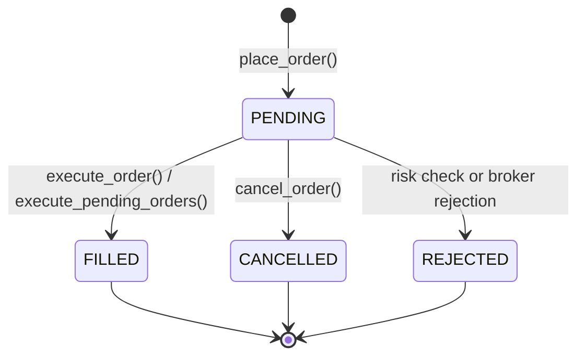

# Vega Quant Trading Engine

A modular Python trading engine with lightweight supporting services for API,
dashboard, and state caching. Built as a technical assessment for a Quant
Developer role at Vega Developers.

The core trading and backtest engine is a single-process Python application.
Redis, FastAPI, and Streamlit run as lightweight companion services via Docker Compose.

---

## Project Status

| Phase | Status | Description |
|---|---|---|
| Phase 1 | Complete | Data foundation: models, CSV/tick loaders, tick aggregation, contracts |
| Phase 2 | Complete | Storage: Parquet + DuckDB |
| Phase 3 | Complete | Technical indicators from first principles: EMA, RSI, ATR, OBV |
| Phase 4 | Complete | Deterministic macro regime engine, overrides & circuit breaker |
| Phase 5A | Complete | Order models, PaperBroker, Idempotency, Risk Manager, Kill Switch |
| Phase 5B | Complete | Portfolio & accounting, average-cost basis, mark-to-market, drawdown, Decimal precision |
| Phase 6–9 | Planned | Strategies, backtest, walk-forward, Redis, API |

---

## Quick Start

```bash
# Install dependencies
pip install -r requirements.txt

# Generate synthetic sample data
python scripts/generate_sample_data.py

# Run all tests
pytest -q
```

---

## Package Structure

```
vega/
  data/          Market data loading and storage
  indicators/    Technical analysis (EMA, RSI, ATR, OBV) — Phase 3
  macro/         Macro regime engine — Phase 4
  strategy/      ATR Grid and Stop-and-Reverse strategies — Phase 6
  risk/          Pre-order risk management — Phase 5
  orders/        Order and fill models — Phase 5
  broker/        PaperBroker + KiteBroker skeleton — Phase 5
  portfolio/     Position and P&L tracking — Phase 6
  engine/        Backtest and walk-forward — Phase 7
  reporting/     Trade blotter and backtest reports — Phase 7
  cache/         Redis latest-state cache — Phase 9
  api/           FastAPI REST endpoints — Phase 9
dashboard/       Streamlit dashboard — Phase 9
tests/           pytest test suite
validation/      pandas-ta / vectorbt cross-validation (optional)
data/market/     Synthetic sample OHLCV CSV files
data/macro/      Synthetic sample macro CSV files
```

---

## Storage Design

### Why Apache Parquet?

Parquet is a **columnar binary format** built for time-series data.

| Property | CSV | Parquet |
|---|---|---|
| Size | ~1x baseline | ~5–10x smaller |
| Column access | Reads entire row | Reads only requested columns |
| Timestamp handling | String parsing on every load | Native datetime64 storage |
| Schema enforcement | None | Typed schema per column |

When a strategy needs only the `close` column for 5 years of daily data,
Parquet reads only that column's bytes from disk. CSV reads every character
of every row.

**Float64 round-trip accuracy**: Python floats are 64-bit IEEE 754. Parquet
stores them as float64. Reading back produces the bit-identical float64 —
exact equality (`==`) holds. No precision is lost in the save/load cycle.

### Why DuckDB?

DuckDB is an **in-process analytical SQL engine**. It reads Parquet files
directly — no server, no background process, no configuration file.

```python
import duckdb
conn = duckdb.connect()   # in-memory, nothing written to disk

# Query Parquet directly with SQL
rows = conn.execute("""
    SELECT AVG(close), MIN(low), MAX(high)
    FROM   read_parquet('data/market/NIFTY50.parquet')
    WHERE  timestamp >= '2023-01-01'
      AND  timestamp <= '2023-03-31'
""").fetchall()
```

DuckDB applies **predicate pushdown** into the Parquet reader: only rows
matching the `WHERE` clause are read from disk, not the whole file.

### Why NOT PostgreSQL?

PostgreSQL is the right tool when you need:
- A running database server that multiple applications write to simultaneously
- Complex relational joins across many tables
- Live transactional writes with ACID guarantees

This project needs none of those things. Our data is append-only historical
OHLCV data, read by a single process. Parquet + DuckDB is sufficient and
requires zero operational overhead.

PostgreSQL would be the right upgrade if the engine were deployed in a
multi-user environment with live data streaming from multiple sources.

### Data Flow

```
CSV files / Tick CSV
        |
        v  (csv_loader / tick_loader / tick_aggregator)
  list[Bar]
        |
        v  (ParquetStore.save)
  .parquet file   <-- single source of truth on disk
        |
        +---> ParquetStore.load()    --> list[Bar]  (full file)
        |
        +---> DuckDBStore.query_bars()  --> list[Bar]  (date-range filtered)
        +---> DuckDBStore.count_bars()  --> int
        +---> DuckDBStore.min_low()     --> float
        +---> DuckDBStore.max_high()    --> float
        +---> DuckDBStore.avg_volume()  --> float
        +---> DuckDBStore.run_sql()     --> list[tuple]  (arbitrary SQL)
```

**DuckDB does not store a separate copy of the data.** Deleting a `.parquet`
file removes the data from both `ParquetStore` and `DuckDBStore`.

---

## Technical Analysis Indicators

The engine computes technical indicators from first principles using pure Python and NumPy. No black-box indicator libraries are used in the core trading engine.

### Core Indicators

| Indicator | Module | Measures | Formula / Recurrence |
|---|---|---|---|
| **EMA** | [`vega.indicators.ema`](vega/indicators/ema.py) | Trend-following momentum | $EMA_t = \alpha P_t + (1 - \alpha) EMA_{t-1}$, with $\alpha = \frac{2}{period + 1}$. Initialized via SMA of first `period` prices at index `period - 1`. |
| **RSI** | [`vega.indicators.rsi`](vega/indicators/rsi.py) | Momentum & overbought/oversold levels | $RSI = 100 - \frac{100}{1 + RS}$, with Wilder-smoothed average gains and losses. Handles zero loss (100.0), zero gain (0.0), and flat prices (50.0). |
| **ATR** | [`vega.indicators.atr`](vega/indicators/atr.py) | Market volatility & gap risk | $TR_t = \max(H_t - L_t, \|H_t - C_{t-1}\|, \|L_t - C_{t-1}\|)$ with $TR_0 = H_0 - L_0$. Smoothed via Wilder recursion: $ATR_t = \frac{ATR_{t-1}(N-1) + TR_t}{N}$. |
| **OBV** | [`vega.indicators.obv`](vega/indicators/obv.py) | Cumulative volume flow | $OBV_t = OBV_{t-1} \pm V_t$ based on close comparison ($C_t > C_{t-1} \implies +V$, $C_t < C_{t-1} \implies -V$). Seeded at $OBV_0 = V_0$. |

### Why Implement From First Principles?

1. **Explainability in Interviews**: Every formula, seed convention, and recurrence relation is explicit and readable in 30 seconds.
2. **Transparency on Edge Cases**: Black-box libraries often mask warmup periods, silently return NaNs, or use undocumented seed heuristics. Vega makes all warmup delays and flat-price conventions explicit.
3. **No Framework Lock-in**: The core calculation logic operates on pure Python numeric sequences and `vega.data.models.Bar` objects, with zero reliance on Pandas Series metadata or TA-Lib C-extensions.

### Independent Reference Validation (`pandas-ta`)

[`validation/validate_indicators.py`](validation/validate_indicators.py) uses `pandas-ta` **only as an independent reference**:
- **EMA & OBV**: Bit-identical matches against `pandas-ta` (`max_diff = 0.0`).
- **RSI**: Bit-identical match from index 14 onwards (`max_diff < 1e-13`). `pandas-ta` seeds one bar earlier at index 13 by taking an initial mean over 13 differences (due to `diff()[0]` being NaN), whereas Vega strictly adheres to Wilder's 1978 textbook definition requiring 15 price points to form 14 price changes.
- **ATR**: Evaluates True Range with $TR_0 = H_0 - L_0$ in the initial SMA seed. `pandas-ta` drops $TR_0$ as NaN, causing a minor seed difference (~0.018) that decays exponentially by $\frac{13}{14}$ per bar and converges to $< 0.001$ after warmup.

---

## Macro Regime Engine

The engine features a deterministic, transparent Macro Regime Engine ([`vega.macro.engine`](vega/macro/engine.py)) that classifies the macro environment to adapt strategy parameters and trigger circuit-breaker protections.

### Macro Inputs

The engine consumes three transparent market proxy indicators:
1. **India VIX** (`india_vix`): Implied volatility of NIFTY options, measuring near-term market fear/complacency.
2. **NIFTY 200-Day Trend** (`nifty_trend`): Precomputed normalized trend signal representing the NIFTY relationship to its 200-day EMA:
   $$\text{nifty\_trend} = \frac{\text{NIFTY close} - \text{NIFTY 200-day EMA}}{\text{NIFTY 200-day EMA}}$$
   - $\text{nifty\_trend} \ge 0 \implies \text{NIFTY is at/above its 200-day EMA}$
   - $\text{nifty\_trend} < 0 \implies \text{NIFTY is below its 200-day EMA}$
   *(Note: This is a precomputed input; the engine does NOT calculate a 200-day EMA from the 120 synthetic macro rows).*
3. **USD/INR** (`usdinr`): Spot currency exchange rate, capturing emerging-market currency stress and foreign capital flight.

### Deterministic Scoring Rules

| Component | Condition | Score | Rationale |
|---|---|---|---|
| **India VIX** | VIX < 14.0 | **+2.0** | Low volatility; complacency supports trend continuation |
| | 14.0 <= VIX <= 20.0 | **0.0** | Normal volatility range |
| | VIX > 20.0 | **-2.0** | Elevated volatility; heightened crash risk |
| **NIFTY Trend** | NIFTY >= 200-day EMA | **+1.0** | Price above long-term moving average (structural bull) |
| | NIFTY < 200-day EMA | **-1.0** | Price below long-term moving average (structural bear) |
| **USD/INR** | USDINR < 84.0 | **+1.0** | Stable domestic currency; healthy foreign flows |
| | USDINR >= 84.0 | **-1.0** | Currency depreciation / macro stress |

### Regime Classification

The composite score ranges from **-4.0 to +4.0**:
- **BULLISH** (`score >= +2.0`): Favorable macro environment.
- **BEARISH** (`score <= -2.0`): Adverse macro environment.
- **NEUTRAL** (`otherwise`): Mixed or transitional macro environment.

### Parameter Overrides

The engine adjusts trading risk without mutating global configuration:
- **BULLISH**: Standard position cap (`atr_position_cap = 5`), standard grid spacing (`atr_grid_multiplier = 1.5`).
- **NEUTRAL**: Baseline unadjusted parameters (`atr_position_cap = 5`, `atr_grid_multiplier = 1.5`).
- **BEARISH**: Reduced position cap (`atr_position_cap = 2`) and wider grid spacing (`atr_grid_multiplier = 2.0`) to avoid rapid fills and preserve capital during volatile selloffs.

### Circuit Breaker Decision

The macro engine evaluates `is_circuit_breaker_triggered(snapshot)`:
- **Condition**: Triggers when `regime == Regime.BEARISH` **AND** `india_vix > circuit_breaker_vix_threshold` (20.0).
- **Behavior**: Returns `True` to block all new entry orders during tail-risk volatility spikes. (Order cancellation and position flattening are delegated to the Risk Manager in Phase 5).

### Why Rule-Based Rather Than Machine Learning?

1. **Explainability in Production & Audits**: In quant trading, macro regime shifts must be explainable in seconds to risk officers, portfolio managers, and interviewers. Black-box ML models (e.g. Hidden Markov Models, Random Forests) are prone to regime hallucination and overfit on small historical macro datasets.
2. **Zero Lookahead & Overfitting**: Static, economically grounded thresholds (14/20 VIX, 200-day EMA, USDINR stress level) ensure zero lookahead bias and prevent curve-fitting to the 120-row sample dataset.
3. **Deterministic State Transitions**: Identical macro inputs and configuration guaranteed to produce bit-identical decisions.

### Worked Example

```text
Input Snapshot:
  - India VIX = 22.5      (> 20.0) -> Score = -2.0
  - NIFTY Trend = -0.015  (< 0.0)  -> Score = -1.0
  - USD/INR = 82.80       (< 84.0) -> Score = +1.0

Composite Score:
  Total Score = -2.0 + (-1.0) + 1.0 = -2.0

Classification:
  Score is <= -2.0  ==> Regime: BEARISH

Decision:
  - Parameter Overrides: position_cap reduced to 2, grid_multiplier widened to 2.0
  - Circuit Breaker: Triggered (BEARISH + VIX 22.5 > 20.0) -> Trading blocked

---

## Orders, Broker & Risk Management (Phase 5A)

Phase 5A establishes the transactional foundation of the trading engine: strict order lifecycle models, an idempotent paper execution broker, decoupled execution semantics, and a deterministic pre-order risk validation gate.

### 1. Order Lifecycle & State Machine

Orders are modeled in [`vega.orders.models`](vega/orders/models.py) with explicit, non-bypassable state transitions:



- **Legal transitions**: `PENDING -> FILLED`, `PENDING -> CANCELLED`, `PENDING -> REJECTED`.
- **Terminal states**: `FILLED`, `CANCELLED`, and `REJECTED` are terminal. Attempting to transition from any terminal state (e.g. `FILLED -> PENDING`, `CANCELLED -> FILLED`, `FILLED -> FILLED`) raises `InvalidOrderStateTransitionError`.
- **Construction invariants**: Every `Order` and `Fill` validates required fields at instantiation (non-empty `client_order_id`, `quantity > 0`, `price >= 0.0`, `filled_price > 0`, `brokerage >= 0`).

### 2. Idempotency

Duplicate order submission is a critical failure mode in automated trading. Vega enforces idempotency at the broker boundary via `client_order_id`, distinguishing two distinct cases:
- **Case A (Identical parameters)**: Submitting an order with an already-tracked `client_order_id` and identical parameters (`symbol`, `side`, `quantity`, `price`) **returns the existing order instance**. No duplicate order is registered, no second position is initiated, and internal broker state is never mutated.
- **Case B (Conflicting parameters)**: Submitting an order with an already-tracked `client_order_id` but conflicting core parameters raises [`IdempotencyConflictError`](vega/broker/paper.py). The existing order remains completely unchanged and protected.

### 3. Broker Interface & PaperBroker

The broker abstraction ([`vega.broker.base.AbstractBroker`](vega/broker/base.py)) exposes a clean public interface:
- `place_order(order: Order) -> Order`
- `cancel_order(client_order_id: str) -> Order`
- `get_order(client_order_id: str) -> Order | None`
- `get_all_orders() -> list[Order]` (returns a shallow list copy; callers cannot mutate internal collections)
- `get_fills(order_id: str | None = None) -> list[Fill]`

The [`PaperBroker`](vega/broker/paper.py) provides deterministic local simulation without network calls:
- **Order Submission vs. Execution**: `place_order()` enqueues the order as `PENDING`. Strategies do **not** supply fill prices—in real markets, execution environments determine fills.
- **Execution Mechanism**: Execution is explicitly triggered via `execute_pending_orders(market_price, timestamp)` or `execute_order(client_order_id, market_price, timestamp)`. This clean decoupling enables future backtesting and walk-forward engines to evaluate fills precisely at subsequent bar opens/closes.
- **Deterministic Slippage**:
  - **BUY**: $\text{fill\_price} = \text{round}(\text{market\_price} \times (1 + \text{slippage\_pct}), 2)$
  - **SELL**: $\text{fill\_price} = \text{round}(\text{market\_price} \times (1 - \text{slippage\_pct}), 2)$
- **Deterministic Brokerage**:
  - $\text{brokerage} = \text{round}(\text{fill\_price} \times \text{quantity} \times \text{brokerage\_pct}, 2)$

### 4. Risk Manager & Order Semantics

The [`RiskManager`](vega/risk/manager.py) acts as a strict pre-order gate answering **"Is this order allowed?"**:
- It does **NOT** place or execute orders.
- It does **NOT** mutate broker state or order collections.
- It explicitly classifies proposed orders into [`OrderEffect`](vega/risk/manager.py) to eliminate ambiguities:
  1. `NEW_ENTRY`: Opening a position from flat (`current_position == 0`).
  2. `SAME_DIRECTION_ENTRY`: Adding to an existing open long or short position. Pyramiding check applies: rejected if $\text{current\_pyramids} \ge \text{max\_pyramids}$.
  3. `PARTIAL_REDUCTION`: Opposite-side order smaller than open position (e.g. LONG +3, SELL 1 $\rightarrow$ +2). Pyramiding controls **never** block reductions.
  4. `COMPLETE_REDUCTION`: Opposite-side order exactly matching open position (e.g. LONG +3, SELL 3 $\rightarrow$ 0). Allowed unconditionally under pyramiding.
  5. `REVERSAL`: Opposite-side order larger than open position (e.g. LONG +3, SELL 5 $\rightarrow$ -2). Closes all existing legs and opens a new opposite position starting at leg 1. Evaluated against position cap and order quantity limits.

| Risk Control | Mechanism | Boundary / Rule | Action on Breach |
|---|---|---|---|
| **Kill Switch** | `enable_kill_switch()` / `disable_kill_switch()` | Active status blocks all incoming orders | Rejects proposed order immediately |
| **Macro Circuit Breaker** | Consumes Macro Regime Engine output | `macro_circuit_breaker == True` | Rejects entry orders during tail-risk macro events |
| **Daily Loss Limit** | Evaluates realized P&L | `daily_realized_pnl <= -daily_loss_limit` (inclusive) | Rejects proposed order to protect capital |
| **Max Order Quantity** | Single order limit | `order.quantity <= max_order_quantity` | Rejects oversized orders |
| **Position Cap** | Resulting net position | $\lvert \text{current\_position} + \Delta \rvert \le \text{position\_cap}$ | Rejects order (supports macro regime overrides) |
| **Pyramiding Limit** | Evaluates explicit `OrderEffect` | Blocked if `SAME_DIRECTION_ENTRY` and $\text{legs} \ge \text{limit}$ | Blocks adding legs; **never** blocks reductions |

### 5. Numerical Discipline & Precision Policy

- **Indicators & Time Series**: Processed using 64-bit IEEE 754 floating-point (`float64`) for speed and compatibility with NumPy/DuckDB.
- **Execution Calculations**: Slippage and transaction costs retain full `float64` precision during intermediate steps without premature rounding.
- **Paise Rounding Semantics**: Final fill prices and brokerage fees are rounded to 2 decimal places using Python's built-in `round(value, 2)`. Python's `round()` implements IEEE 754 round-half-to-even (banker's rounding), preventing cumulative upward or downward bias across thousands of trade simulations.
- **Monetary Accounting**: Comprehensive monetary precision policies (e.g. Decimal representations for cash balances and ledger tracking) will be established during the Portfolio phase.

### 6. Zerodha KiteBroker Skeleton

[`vega.broker.kite.KiteBroker`](vega/broker/kite.py) provides a safe stub conforming to `AbstractBroker`:
- Contains **no credentials** and makes **no network calls**.
- All placement and execution methods raise `NotImplementedError` with descriptive messages.
- Real broker connectivity is strictly deferred to future live execution phases.

---

## Portfolio & Accounting Layer (Phase 5B)

Phase 5B implements the [`Portfolio`](vega/portfolio/portfolio.py) accounting engine, consuming execution `Fill` objects and maintaining exact cash balances, average cost basis, realized and unrealized P&L, equity, and drawdown.

### 1. Average-Cost Accounting

Positions are tracked per-symbol with weighted average-cost basis:
- **Opening a position**: Initial entry price equals fill price.
- **Increasing position**: Weighted average:
  $$\text{new\_avg\_price} = \frac{(\text{old\_qty} \times \text{old\_avg}) + (\text{new\_qty} \times \text{fill\_price})}{\text{total\_qty}}$$
- **Reducing position**: Remaining units preserve the existing average entry price unchanged.
  - **Long exit**: $\text{realized\_pnl} = (\text{exit\_price} - \text{average\_entry\_price}) \times \text{closed\_qty}$
  - **Short exit**: $\text{realized\_pnl} = (\text{average\_entry\_price} - \text{exit\_price}) \times \text{closed\_qty}$
- **Reversals (crossing zero)**: First closes the existing position and realizes its P&L, then establishes the residual opposite position at the new fill price.
- **Complete exits**: Net quantity becomes 0, and average entry price and unrealized P&L reset to zero.

### 2. Transaction Costs & Cash Accounting

Brokerage is deducted deterministically upon fill processing:
- **BUY**: $\text{cash} \leftarrow \text{cash} - (\text{fill\_price} \times \text{qty} + \text{brokerage})$
- **SELL**: $\text{cash} \leftarrow \text{cash} + (\text{fill\_price} \times \text{qty} - \text{brokerage})$
- Guarantee: Cash and equity always reflect net capital after all commissions.

### 3. Mark-to-Market & Valuation

The portfolio provides `mark_to_market(symbol, market_price)`:
- **Long**: $\text{unrealized\_pnl} = (\text{market\_price} - \text{average\_entry\_price}) \times \text{qty}$
- **Short**: $\text{unrealized\_pnl} = (\text{average\_entry\_price} - \text{market\_price}) \times \lvert\text{qty}\rvert$
- **Flat**: $\text{unrealized\_pnl} = 0$
- **Total Equity**:
  $$\text{equity} = \text{cash} + \sum (\text{position\_quantity} \times \text{market\_price})$$

### 4. Peak Equity & Drawdown

Tracks portfolio risk metrics dynamically:
- **Peak Equity**: $\text{peak} = \max(\text{peak}, \text{current\_equity})$
- **Drawdown**: $\text{drawdown} = \text{peak} - \text{current\_equity}$
- **Drawdown Percentage**:
  $$\text{drawdown\_pct} = \frac{\text{drawdown}}{\text{peak}} \times 100$$
  *(Safely handles zero initial/peak equity).*

### 5. Daily Realized P&L

[`get_daily_realized_pnl(trading_date)`](vega/portfolio/portfolio.py) provides daily realized P&L aggregated by trading date (via `datetime.date` object or ISO string `"YYYY-MM-DD"`). This allows the [`RiskManager`](vega/risk/manager.py) to directly enforce its daily loss limit without mark-to-market noise.

### 6. Monetary Precision Policy

All portfolio accounting values are represented as Python `Decimal` rounded to 2 decimal places (`Decimal("0.01")`) using banker's rounding (`ROUND_HALF_EVEN`). Float prices from `Fill` objects are strictly converted using `Decimal(str(val))` to avoid binary floating-point representation artifacts.

---

## Configuration

All tunable parameters are in [`config.yaml`](config.yaml).
Copy [`config.example.yaml`](config.example.yaml) as a starting reference.

To override locally without committing changes, create `config.local.yaml`
(already in `.gitignore`).

> **Security**: `config.yaml` contains only numeric parameters.
> Broker credentials (when added in a future phase) must go in
> `config.local.yaml` — never in `config.yaml`.

---

## Sample Data

Synthetic sample data is generated by `scripts/generate_sample_data.py`
(seeded with `random.seed(42)` for reproducibility):

| File | Rows | Description |
|---|---|---|
| `data/market/NIFTY50_daily.csv` | 120 | Daily OHLCV bars, Jan–Jun 2023 |
| `data/market/NIFTY50_ticks.csv` | 60 | Intraday ticks for 2023-01-02 |
| `data/macro/macro_data.csv` | 120 | NIFTY trend, India VIX, USDINR |

All unit tests use **synthetic, hand-crafted data** created in `tests/conftest.py`.
No test reads from these CSV files.

---

## Testing & Validation

```bash
# Run all unit and validation tests
pytest -v

# Run specific test suites
pytest tests/test_tick_aggregation.py -v
pytest tests/test_parquet_store.py -v
pytest tests/test_duckdb_store.py -v
pytest tests/test_indicators.py -v
pytest tests/test_indicator_validation.py -v
pytest tests/test_macro.py -v
pytest tests/test_orders.py -v
pytest tests/test_paper_broker.py -v
pytest tests/test_risk.py -v
pytest tests/test_portfolio.py -v

# Run standalone independent cross-validation against pandas-ta
python validation/validate_indicators.py
```

Tests are grouped by component. All use synthetic data — no CSV files,
no network access, no external services required.

